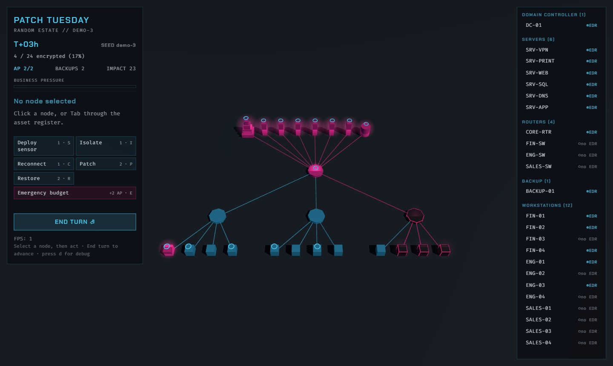
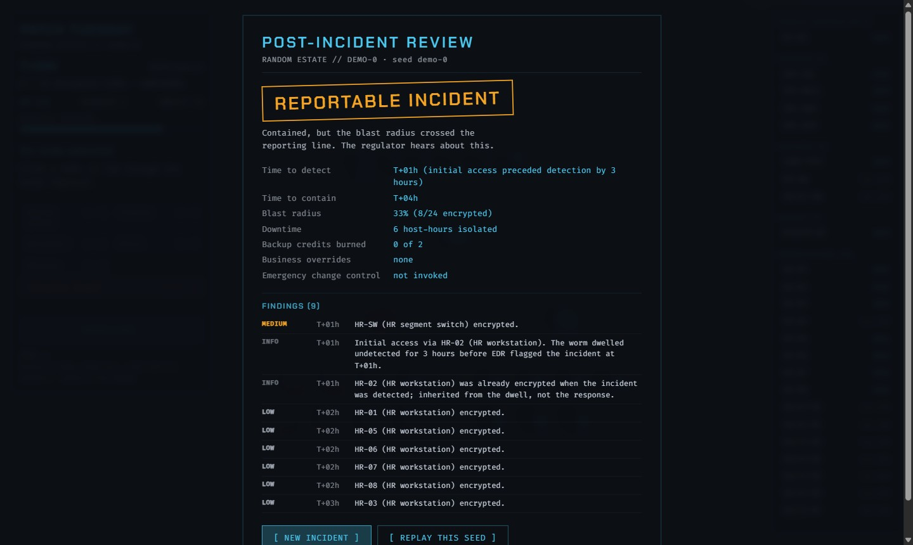

# Patch Tuesday

It's 03:12 on a Wednesday and the on-call phone is screaming. Ransomware is loose on the network and you're the incident lead. Every turn is an hour of the incident. Isolate segments, burn your backups wisely, patch what you can reach, and decide what the board gets told. It's turn-based tactics where every mechanic is real incident response tradecraft, and it ends in the Post-Incident Review you deserve.

**Play it:** https://patch-tuesday.vercel.app

Second game in the [Sonofg0tham](https://github.com/Sonofg0tham) security games series, after [Tailgate](https://github.com/Sonofg0tham/tailgate).



## What it is

A low-poly 3D network of about 24 nodes. Ransomware starts on an edge workstation, dwells undetected for a few hours, then you get paged to an established foothold. From there it's you against the worm: it spreads node to node each turn, and you spend two action points an hour to contain it.

The catch is that every move is a trade-off. Isolating a segment stops the spread but takes the business offline, and if you leave too much cut off, business pressure builds until the business overrides you and reconnects your oldest containment, ready or not. Restoring a node burns a backup credit you might need more later. You fight what you can see, and EDR coverage has gaps, so the scariest node on the board is the one showing green because nothing is watching it.

Lose the domain controller, or let 60 percent of the estate encrypt, and it's over. Contain the worm and you file the review.

## Controls

Mouse-first, fully keyboard-accessible, no twitch inputs anywhere.

- **Click** a node to inspect it, **click** an action to spend an action point.
- **Tab** through the asset register on the right to reach every node by keyboard.
- Action hotkeys act on the selected node: **S** deploy sensor, **I** isolate, **C** reconnect, **P** patch, **R** restore, **E** emergency budget.
- **Enter** ends the turn. **Esc** pauses. **d** toggles the debug true-vs-visible overlay.

## The Post-Incident Review

Win or lose, the run ends in a one-page Post-Incident Review, generated from what actually happened. It reads like a real security document: time to detect, time to contain, blast radius, downtime, backup credits burned, business overrides with timestamps, and findings drawn from the event log with node names and T+ times ("EDR coverage gap on FIN-SW allowed undetected lateral movement, T+02h"). You get one of four ratings, from NEAR MISS down to TOTAL LOSS, and best ratings persist per scenario.



## The locked economy

The whole game is balanced around one set of numbers that took six measured passes to lock. Rather than tune by feel, each lever (dwell time, then sensors, business pressure, the action-point cut, backup credits, and dwell again) was changed one at a time, measured across thousands of headless bot games, and kept only if a competent reference bot landed inside a 40 to 70 percent win band while a random flailer stayed above 15 percent. The audit trail is the pull request sequence 3.5 through 3.10, each one carrying its before-and-after numbers, and the final v1 baseline is recorded in [GAME_DESIGN.md](GAME_DESIGN.md); when procedural boards were added in Phase 4, the same balance gate proved the locked economy survived the variety.

## Stack

Three.js, TypeScript (strict) and Vite. No game engine and no physics library. There are no asset files: every visual is procedural geometry built in code, and every sound is synthesised through the Web Audio API. The 3D canvas draws only the board; all UI (the HUD, the menus, the review) is a DOM overlay, for crisp text and sane accessibility. It deploys to Vercel as a static build, with no backend, no accounts and no analytics; settings and best runs live in localStorage.

## Development

```bash
npm install
npm run dev        # local dev server
npm run build      # production build (typecheck + Vite)
npm run typecheck  # TypeScript, no emit
npm run lint       # ESLint
npm test           # Vitest
```

The headless balance scripts (`npm run gen`, `npm run dwell`, `npm run pir`, `npm run bots`) are how the economy was measured and how it stays honest.

Every pull request must pass typecheck, lint, the test suite and a gitleaks secret scan in CI before it can merge to main.

## Licence

Code is [MIT](LICENSE). The two bundled fonts stay under the SIL Open Font License 1.1; fonts and the one hand-authored favicon are recorded in [CREDITS.md](CREDITS.md). Everything else is generated in code.
